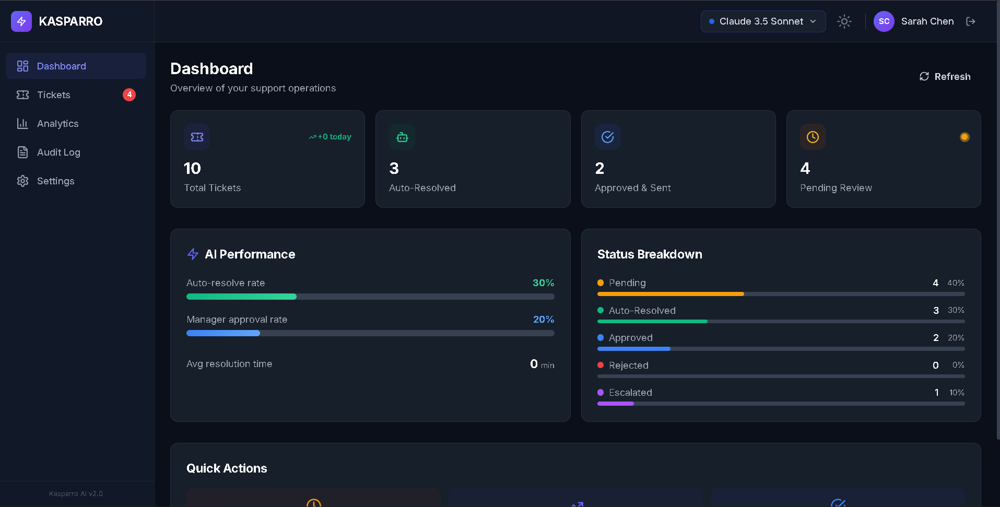
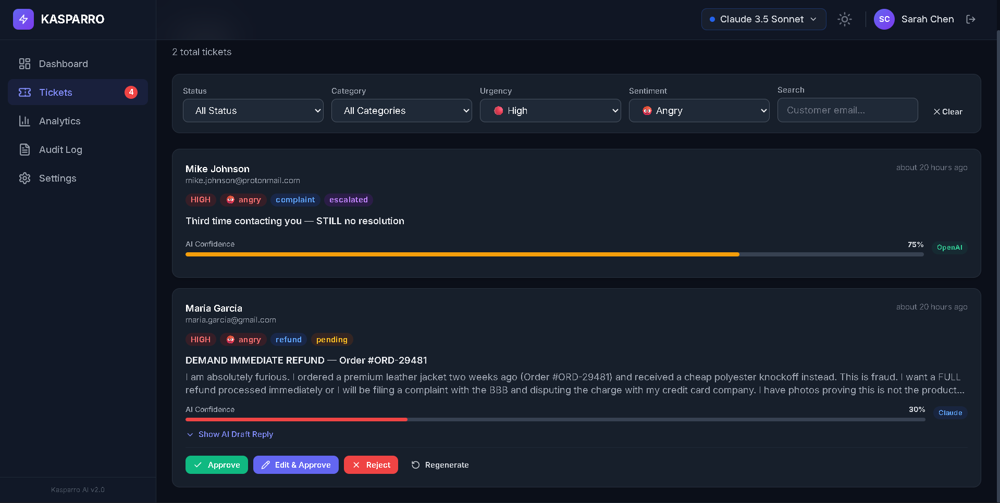
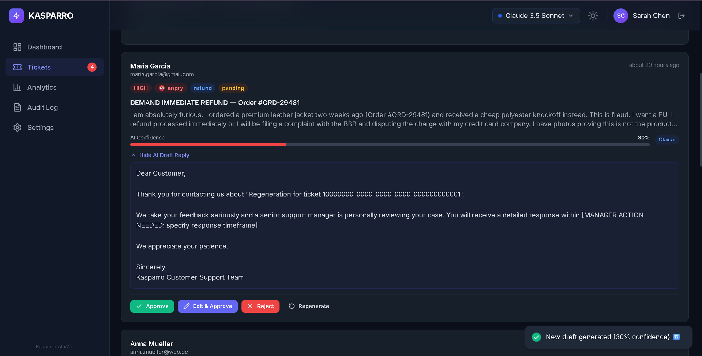
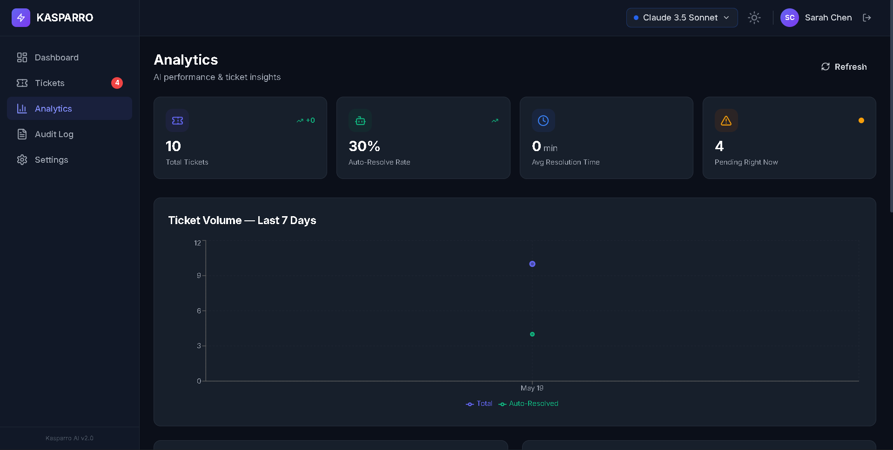
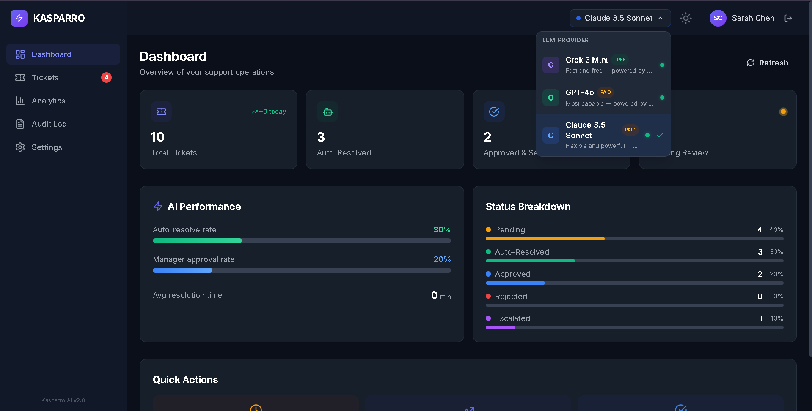

# Kasparro AI Customer Support Agent
An intelligent, dual-path automation platform that categorizes, routes, and drafts responses to customer support emails.

    

## 🎯 Problem Statement
Customer support teams at e-commerce brands are overwhelmed during peak seasons, resulting in slow response times and inconsistent reply quality. Human agents spend the majority of their time answering simple, repetitive questions instead of focusing on complex, relationship-saving interactions.

## ✨ What It Does
*   **Intelligent Ingestion:** Automatically fetches emails from a support Gmail inbox.
*   **AI Categorization:** LangGraph agent categorizes emails by intent, sentiment, and urgency.
*   **Dual-Path Routing:** Safely auto-resolves low-risk queries (FAQs, tracking) and routes high-risk queries (refunds, complaints) to a manager dashboard.
*   **AI Drafting:** Generates context-aware, empathetic email drafts for human approval.
*   **Multi-LLM Support:** Seamlessly switch between Grok, OpenAI, and OpenRouter directly from the dashboard.
*   **Audit Trail:** Maintains a strict, immutable database log of every automated and manual action.

## 🏗️ Architecture
```text
[React] → [NGINX] → [Node.js + Redis] → [PostgreSQL]
                  ↘ [FastAPI + LangGraph] → [Gmail API]
                                          → [Grok / OpenAI / OpenRouter]
```

## 🛠️ Tech Stack
| Layer | Technology | Purpose |
|-------|------------|---------|
| **Frontend** | React 18, Tailwind CSS | Responsive, real-time dashboard for managers to review tickets and analytics. |
| **Backend** | Node.js, Express.js | Core API handling JWT auth, ticket CRUD, and orchestration. |
| **AI Agent** | Python, FastAPI, LangGraph | Dedicated microservice for asynchronous LLM workflows and state machine logic. |
| **Database** | PostgreSQL | Persistent, relational data store enforcing strict schema constraints. |
| **Cache** | Redis | In-memory store for JWT blacklisting and high-speed analytics caching. |
| **Infra** | Docker, NGINX | Containerized multi-service orchestration with a unified reverse proxy. |

## 📋 Prerequisites
*   Docker + Docker Compose installed on your machine
*   A Google Cloud Project with a Gmail account (for OAuth2 setup)
*   Grok API key (available at x.ai)
*   OpenAI API key (optional)
*   OpenRouter API key (optional)

## ⚙️ Environment Setup

**1. Clone the repo:**
```bash
git clone https://github.com/rohanchristos/kasparro-AI-.git
cd kasparro-AI-
```

**2. Configure Environment Variables:**
```bash
cp .env.example .env
```

**3. Fill in the `.env` variables:**
*   `GROK_API_KEY`: Required for the default fast/free AI responses.
*   `OPENAI_API_KEY`: Optional, for premium GPT-4o reasoning.
*   `OPENROUTER_API_KEY`: Optional, for accessing a wide range of LLMs through OpenRouter.
*   `JWT_SECRET`: Random string for signing authentication tokens.

**4. Gmail OAuth2 Setup:**
*   Go to the [Google Cloud Console](https://console.cloud.google.com/).
*   Enable the **Gmail API** and configure the OAuth Consent Screen (add `https://mail.google.com/` scopes).
*   Create an **OAuth Client ID** (Desktop App or Web App).
*   Use the [OAuth 2.0 Playground](https://developers.google.com/oauthplayground/) with your Client ID and Secret to authorize the scopes and generate a **Refresh Token**.
*   Add these to your `.env` as `GMAIL_CLIENT_ID`, `GMAIL_CLIENT_SECRET`, and `GMAIL_REFRESH_TOKEN`.

## 🚀 Running Locally

Build and start the entire microservice architecture:
```bash
docker compose up --build -d
```

*   **Frontend Dashboard:** [http://localhost](http://localhost)
*   **Node.js API:** [http://localhost/api](http://localhost/api)
*   **Python Agent API:** [http://localhost/api/agent](http://localhost/api/agent)
*   **System Health Check:** [http://localhost/api/audit/health](http://localhost/api/audit/health)

## 🔑 Default Login
When the application starts, it seeds a default administrator account into the database:
*   **Email:** `manager@kasparro.com`
*   **Password:** `Manager@123`

## 🧪 Testing Without Real Emails
If you don't want to set up Gmail polling immediately, you can trigger the AI agent manually by sending a POST request to the backend with a mock email:

```bash
curl -X POST http://localhost/api/agent/analyze \
  -H "Content-Type: application/json" \
  -d '{
    "customer_email": "test@example.com",
    "subject": "Where is my order?",
    "message": "I ordered this 3 weeks ago and tracking has not updated.",
    "llm_provider": "grok"
  }'
```
This forces the LangGraph pipeline to execute, draft a response, and insert a ticket into your dashboard queue.

## 📁 Project Structure
```text
kasparro-AI-/
├── agent/            # Python FastAPI microservice (LangGraph AI logic)
├── backend/          # Node.js Express API (Auth, DB, Orchestration)
├── frontend/         # React SPA (Tailwind CSS, Recharts)
├── docs/             # Technical and Product documentation
├── screenshots/      # Application UI screenshots
└── nginx/            # Reverse proxy configuration
```

## 🎥 Demo Video
[Insert Link to YouTube/Drive video here]

## 📸 Screenshots
*   
*   
*   
*   
*   

*(Add your screenshots to the `/screenshots` directory)*

## 📄 Documentation
Dive deeper into the architecture and product decisions:
*   [Product Document](./docs/PRODUCT_DOCUMENT.md)
*   [Technical Document](./docs/TECHNICAL_DOCUMENT.md)
*   [Decision Log](./docs/DECISION_LOG.md)
*   [Walkthrough](./docs/WALKTHROUGH.md)

## 👤 Contribution Note
This was built as a solo project for the Kasparro AI Commerce Hackathon. Time split:
*   **40% Product Thinking:** Architecture decisions, UI/UX design, business rules, human-in-the-loop safety scope.
*   **60% Engineering:** Multi-container deployment, LangGraph implementation, DB integration, debugging.

## 🔮 Future Roadmap
*   **Omnichannel Ingestion:** Expand beyond Gmail to include Slack, WhatsApp, and Instagram DMs.
*   **Autonomous Resolution Execution:** Connect directly to Shopify/Stripe APIs so the AI can execute actual refunds instead of just drafting the email.
*   **CRM Synchronization:** Two-way sync with enterprise systems like Zendesk and Salesforce.

## 📝 License
MIT License. 

---
*Built with precision by **rohantechlabs**.*
