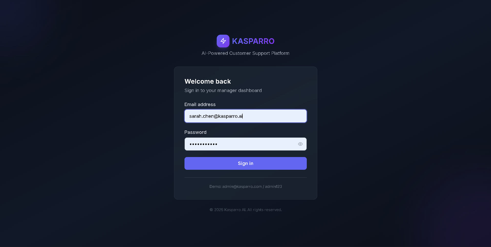
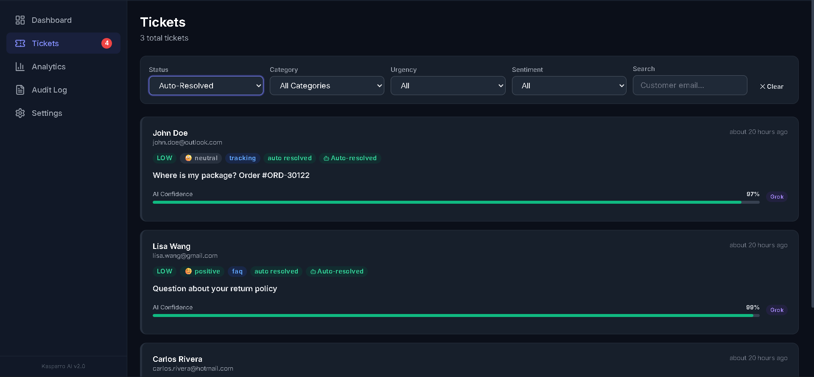
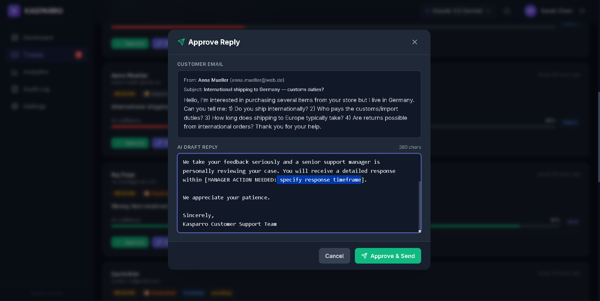
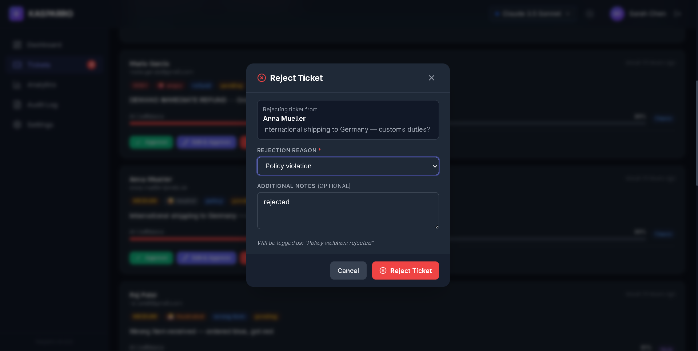
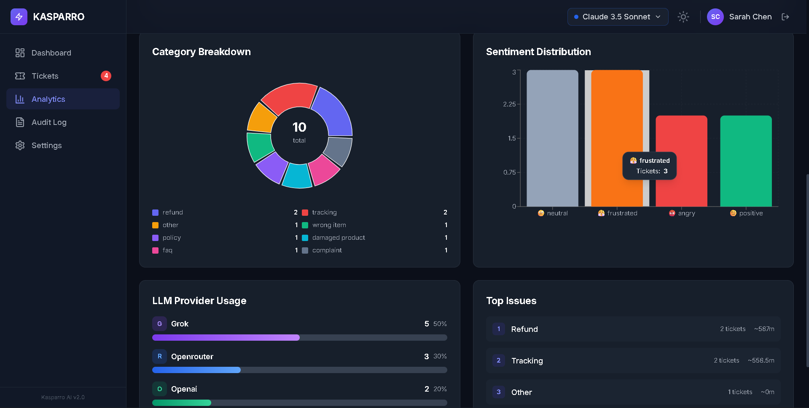
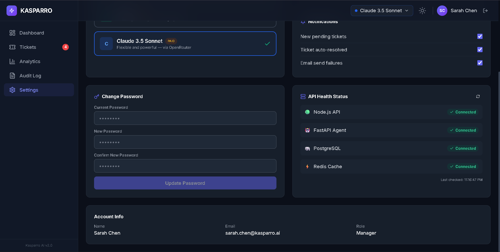
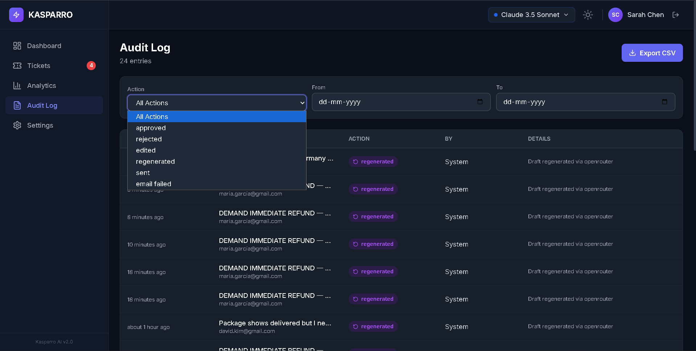

# Product Walkthrough & Screenshots

This document provides a visual walkthrough of the Kasparro AI Customer Support Agent. It guides you through the core screens used by Customer Satisfaction Managers to triage, review, and approve AI-generated emails.

---

### Screen 1: Login Page
**Purpose:** Authenticates managers into the secure support dashboard.
**Screenshot:** 
**What to notice:**
- **Clean aesthetic:** Simple, focused design prevents cognitive overload before a shift.
- **Form validation:** Ensures secure entry without hitting the backend unnecessarily.
- **Brand consistency:** Sets the professional tone of the internal tool immediately.

---

### Screen 2: Main Dashboard / Ticket List (full view)
**Purpose:** Provides a high-level overview of the active ticket queue requiring human intervention.
**Screenshot:** 
**What to notice:**
- **Status Pills:** At-a-glance visibility into Category, Urgency, and Sentiment tags assigned by the AI.
- **Pending focus:** The dashboard defaults to showing only action-required items, hiding auto-resolved tickets by default to keep the queue clean.
- **Provider Badge:** Shows exactly which LLM (e.g., Grok, OpenAI) drafted each specific ticket.

---

### Screen 3: Ticket Card — High Urgency Angry Customer (zoomed)
**Purpose:** Highlights how the system handles critical, high-stress interactions.
**Screenshot:** 
**What to notice:**
- **Urgency indicator:** Visual red indicators instantly draw the manager's eye to high-priority complaints.
- **AI Suggested Action:** The AI explicitly warns the manager (e.g., "URGENT: Manager must write custom response" or "Offer replacement") based on the sentiment.
- **Context visibility:** The original email is presented clearly alongside the drafted response for fast comparison.

---

### Screen 4: Ticket Card — Auto-Resolved (showing green border)
**Purpose:** Demonstrates the completely hands-off automation for low-risk informational tickets.
**Screenshot:** 
**What to notice:**
- **Distinct visual state:** A green border and "Auto-Resolved" badge confirm that no human action is required.
- **Reasoning logged:** Shows exactly *why* the AI chose to auto-resolve (e.g., "Eligible: FAQ with neutral sentiment").
- **Read-only state:** Action buttons are disabled since the email has already been sent to the customer.

---

### Screen 5: Approve Modal (with AI draft visible)
**Purpose:** Allows the manager to review the AI's generated response in detail before sending.
**Screenshot:** 
**What to notice:**
- **Draft contrast:** The generated response is highly visible, making it easy to spot placeholders.
- **[MANAGER ACTION NEEDED] tags:** The AI is instructed to insert clear bracketed placeholders if it lacks the authority to make a promise (like an exact refund timeline).
- **One-click send:** If the draft is perfect, the manager can send it with a single click, saving minutes per ticket.

---

### Screen 6: Edit & Approve Modal (with edited text)
**Purpose:** Enables the manager to manually tweak the AI draft before finalizing the reply.
**Screenshot:** 
**What to notice:**
- **Textarea input:** The draft is fully editable; the manager isn't locked into the AI's exact phrasing.
- **Safe overrides:** Allows the human to fill in the missing context (like tracking numbers or refund amounts) that the AI safely refused to guess.
- **Immediate dispatch:** Clicking "Approve & Send" updates the database and dispatches the edited email instantly via the Gmail API.

---

### Screen 7: Reject Modal
**Purpose:** Provides a safe escape hatch if the ticket cannot be handled currently or the AI missed the mark entirely.
**Screenshot:** 
**What to notice:**
- **Status change:** Marking a ticket as "Rejected" removes it from the pending queue.
- **Audit trail:** Captures the explicit rejection action in the database for later quality assurance reviews.
- **Clean workflow:** Keeps the active queue moving even when anomalies occur.

---

### Screen 8: Analytics Page — KPI Cards
**Purpose:** Displays high-level business metrics regarding support operations.
**Screenshot:** 
**What to notice:**
- **Auto-Resolve Rate:** Proves the ROI of the tool by showing the percentage of tickets handled with zero human labor.
- **Volume tracking:** Shows total tickets processed today versus yesterday.
- **Real-time updates:** Backed by Redis caching for lightning-fast metric aggregation.

---

### Screen 9: Analytics Page — Charts
**Purpose:** Visualizes ticket trends and AI categorization accuracy over time.
**Screenshot:** 
**What to notice:**
- **Category breakdown:** A Recharts pie chart showing the distribution of tickets (e.g., Refunds vs. FAQs).
- **Sentiment tracking:** Helps brand managers understand if negative sentiment is spiking due to a bad product launch or shipping delay.
- **Actionable UI:** Simple, clear charts that require zero data-science knowledge to interpret.

---

### Screen 10: LLM Provider Selector Dropdown
**Purpose:** Allows the user to switch the underlying AI engine powering their agent.
**Screenshot:** 
**What to notice:**
- **Dynamic badging:** Switching between Grok and OpenAI updates the UI brand colors and icons.
- **Instant application:** The choice is saved to the user's profile and applied to the very next ticket regeneration.
- **Cost control:** Empowers the business to decide when to use a free tier vs a premium reasoning model.

---

### Screen 11: Settings Page — Health Status Panel
**Purpose:** Gives the administrator visibility into the system's microservice health.
**Screenshot:** 
**What to notice:**
- **Live pinging:** Shows the connection status to PostgreSQL, Redis, Node.js, and the FastAPI agent.
- **Uptime tracking:** Confirms that all Docker containers are running smoothly.
- **Troubleshooting:** The first place a manager looks if the AI stops drafting responses.

---

### Screen 12: Audit Log Page
**Purpose:** Provides absolute transparency into every action taken by both humans and AI.
**Screenshot:** 
**What to notice:**
- **Action tracking:** Logs exactly when a ticket was `ai_drafted`, `regenerated`, `approved`, or `sent`.
- **Actor attribution:** Distinguishes between actions taken by the System/AI vs. actions taken by a specific human manager.
- **Compliance:** Essential for e-commerce brands needing to prove who authorized a specific financial refund.

---

## User Journey: From Inbox to Resolution

Imagine it’s the middle of the holiday rush. A customer named Sarah receives a shattered mug in the mail. Frustrated, she immediately fires off an email to the support inbox with the subject line "Broken Item - Furious!" 

Within 60 seconds, the Kasparro **EmailPoller** wakes up in the background and pulls her email from the Gmail API. The LangGraph agent immediately goes to work. It reads the context, correctly tags the email as `damaged_product`, registers the sentiment as `angry`, and flags it as `high` urgency. Knowing that damaged products require a human touch and a financial decision, the AI explicitly avoids the auto-resolve path. Instead, it drafts an empathetic apology, proposes a replacement, inserts a placeholder `[MANAGER ACTION NEEDED: insert replacement tracking link]`, and pushes the ticket to the PostgreSQL database.

On the other side of the screen, the Customer Satisfaction Manager sees Sarah’s ticket pop up at the very top of their dashboard, highlighted in red due to its high urgency. They don’t have to read a long thread to understand the problem; the tags tell the whole story instantly. The manager clicks the ticket, reads the AI’s excellent drafted apology, and simply replaces the bracketed placeholder with a newly generated tracking link. They click "Approve & Send." 

Instantly, the Node.js backend updates the ticket status to `sent`, logs the manager's action in the immutable audit trail, and fires off the edited email back to Sarah via the Gmail API. What would normally take a stressed agent 5 minutes to read, comprehend, type out, and send, was handled perfectly in 15 seconds. The manager moves on to the next ticket, and Sarah receives a rapid, professional resolution to her problem.
